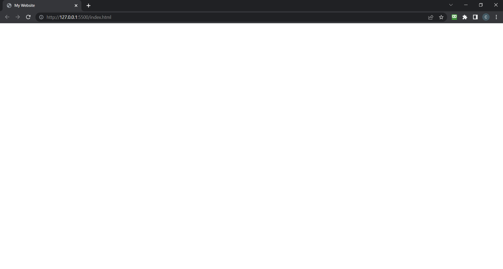

# 😃 Head Section

In the head section, we will only be using HTML. HTML is a markup language that simply sets up all the elements that will come out in the website with no design. Most of the elements we put in HTML are going to be in black and white, however we will be using CSS to make it look cool later on.

---

To begin, we will set the title of the website as well as link our main.css file to our index.html file. This will allow us to customize and design all the things we set up with our html code. To do this, we only need 2 more lines of code.

``` html
<body>
    <meta charset="UTF-8">

    <title>Your name here's Website</title>
    <link rel="stylesheet" href="main.css">
</body>
```

The title line will set whatever you type in between the tabs to be what the tab on the top of your browser says. You will be able to see this by opening the Live Server. To do this, either press __ALT + L, ALT + O__ or right click on index.html in the sidebar next to your code and left click on __Open with Live Server__. You will now be able to see what you have so far and you will be able to see the title of the website on the top of your browser like so:



The other line of code links the main.css file to your index.html file with the relationship of a stylesheet. This tells the computer that we will use the main.css file as a stylesheet for index.html.

Next, we will begin programming in the body tags.