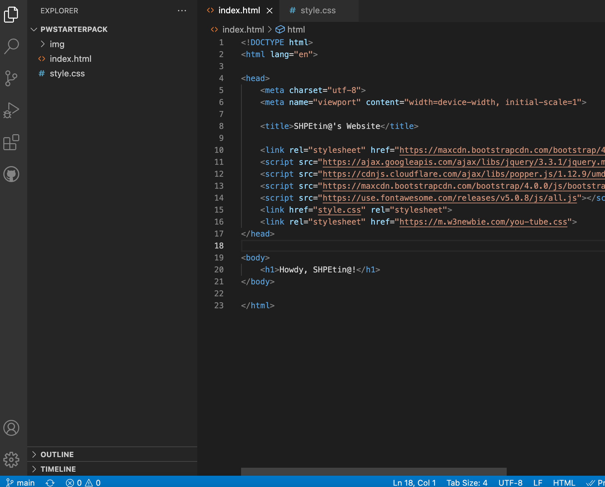

# 📄 Index

## Download additional Bootstrap files

1. Locate your Github repository folder (make sure you know where it is located within your files)
2. [Click here](https://github.com/paulageronimo/PWstarterpack/archive/refs/heads/main.zip) to download a template home page with bootstrap links  (link will automatically download the zip files).
3. Locate the Zip file named 'PWstarterpack-main.zip' in your downloads (or wherever you downloaded it)
4. Unzip the folder (extract files if you're on windows) > drag and drop, or copy + paste, the components of the now un-zipped folder into the Gitup repository folder that we located in step 1

## Index.html

An index file is probably the most important file for creating a website. It is the landing page, essential to have it show up properly.

What should be present in your website folder (Github repository folder) are 📁img, 📄index.html, 📄styles.css

1. Open the index.html file, and it should open in your default web browser (Safari, Edge, Chrome, etc.) with the message

```
Howdy, SHPEtin@!
```

2. Now, go to your Github desktop app and open the repository in VSCode (^ + cmd + A; Repository > Open in Visual Studio Code)



3. 