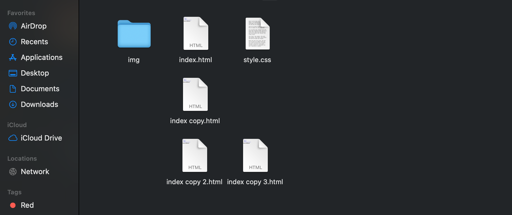

# 🦶🏽 Footer
Self explanatory, a footer is at the *foot* of the page. There, you will add your social media information such as Instagram, Twitter, Linkedin, even email. *Reminder, please make sure that your page is appropriate if you're going to link your social media*

## Adding social media symbols

- Steps on creating footer with link to social media profiles
    1. create a ```<footer>``` block with a basic text indicating towards social media
    2. add a ```<div>``` block inside footer
    3. add an ```<a>``` block inside the ```<div>``` block and paste the link of your social media profile in href="link-goes-here"
    4. add an ```<i>``` block inside the ```<a>``` block and add a ```class="fab fa-facebook"``; change "facebook" to whatever social media you want to link
        - You can view more information and buttons available [HERE](https://www.w3schools.com/howto/howto_css_social_media_buttons.asp)
    5. style the icons on the style sheet to make them bigger


## 🗃 File management & Duplicates
Go ahead and go to your files, and duplicate or make copies of our index file. Make sure to name it for each of our components, except for resume. This will save time, trust me.

Since there are three additional components besides the home/index page, create three additional duplicated pages.

--and, of course, rename them properly. As of now, you should have six total items.
```
1. img folder - for images
2. index.html - home page
3. about.html - about page
4. projects.html - projects page
5. involvement.html - involvement page
6. styles.css - styles file, more useful later
```


### 🎉 Congratulations! You have completed this section 🥳

## 🎈 Thank you for joining us this week! We look forward to you continuing.🤓
💡*[Feedback HERE](https://forms.gle/WhhHnqGNs9q2gV9S6)*🤔