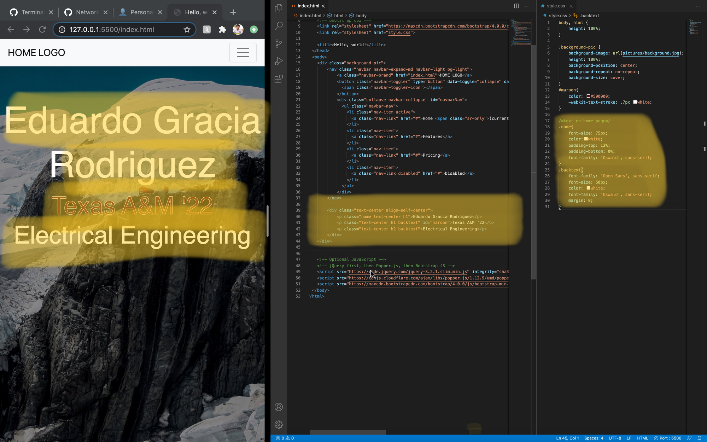

# 🏠 Home/Landing Page

## 💯 The Body

Now go back to the index.html file on VSCode to edit it.

- Background image

    1. In order to add a background picture, create a ```<div class="background-pic">...</div>```, where "..." is going to be whatever we want inside the landing page (for now, we have the navbar, but we will have our names, classification, majors, etc.)
        1. We add a class in order to style it on the style.css file
        2. Style the background picture in ```style.css``` file
        in order to style something, we use the following format:
        ```.NAME_OF_CLASS{ styling goes here}```
        3. In our case, the style.css file  would look as such
        ```css
        body, html {
            height: 100%;
        }  
            
        .background-pic {
            background-image: url(img/background.jpg);
            height: 100%;
            background-position: center;
            background-repeat: no-repeat;
            background-size: cover;
        }
        ```
        Note: ```background-image: url(img/background.jpg);``` in the code above should have the path to your picture in your folder. It can be either a jpg, gif, or jpeg file.
    - helpful links: [https://www.w3schools.com/html/html_images_background.asp](https://www.w3schools.com/html/html_images_background.asp)

- Add name, classifications, etc using a div blocks; format text on the style sheet using padding, color, etc. For example, Eddie's snapshot is added below:

    
    Explanation of classes used above:
    - ```class = "text-center"``` centers the text in the ```<p>``` block
    - ```class = "name" / "backtext"``` are classes I created to format in the style.css file separately from the other classes
    - ```class = "h1" / "h2"``` increases and decreases the size of the font
    - ```id = "maroon"``` is an ID class I created to format in the style.css file separately from all others (you can only have one id in every file)
    - padding controls the whitespace corresponding to the block

### 🎉 Congratulations! You have completed this section 🥳
