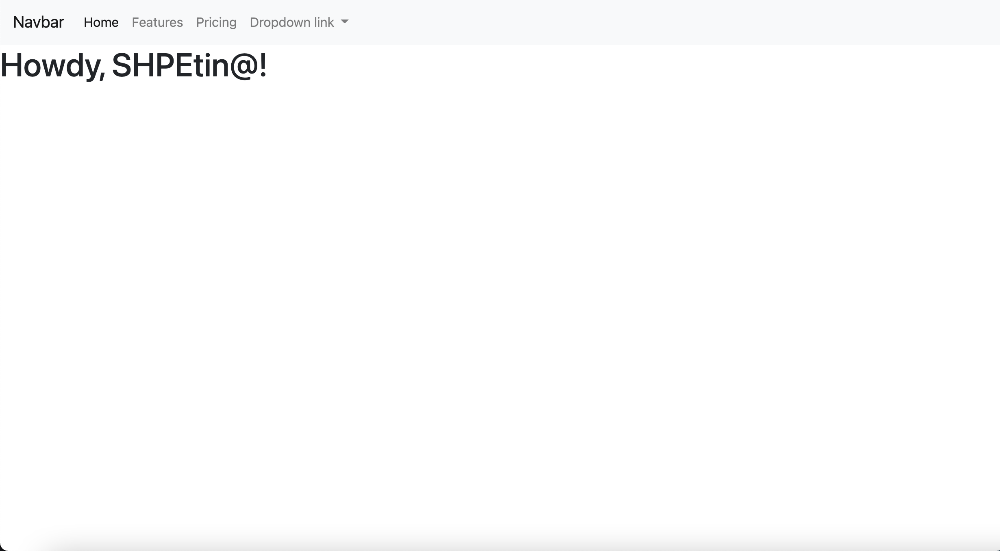

# 🧭 Navigation bar

## 🥾 Bootstrap 

Since we will be working with Boostrap, they have available Navigation (Nav) Bar sections [HERE](https://getbootstrap.com/docs/4.0/components/navbar/). You are also able to view other Bootstrap documentation and guidance.

1. Head on to the link above to view the several nav bar snippets, copy and paste one to your code in the ```<body></body>``` section, over the "Howdy" header. Below is a sample you can copy and paste there.

```
<nav class="navbar navbar-expand-lg navbar-light bg-light">
  <a class="navbar-brand" href="#">Navbar</a>
  <button class="navbar-toggler" type="button" data-toggle="collapse" data-target="#navbarNavDropdown" aria-controls="navbarNavDropdown" aria-expanded="false" aria-label="Toggle navigation">
    <span class="navbar-toggler-icon"></span>
  </button>
  <div class="collapse navbar-collapse" id="navbarNavDropdown">
    <ul class="navbar-nav">
      <li class="nav-item active">
        <a class="nav-link" href="#">Home <span class="sr-only">(current)</span></a>
      </li>
      <li class="nav-item">
        <a class="nav-link" href="#">Features</a>
      </li>
      <li class="nav-item">
        <a class="nav-link" href="#">Pricing</a>
      </li>
      <li class="nav-item dropdown">
        <a class="nav-link dropdown-toggle" href="#" id="navbarDropdownMenuLink" data-toggle="dropdown" aria-haspopup="true" aria-expanded="false">
          Dropdown link
        </a>
        <div class="dropdown-menu" aria-labelledby="navbarDropdownMenuLink">
          <a class="dropdown-item" href="#">Action</a>
          <a class="dropdown-item" href="#">Another action</a>
          <a class="dropdown-item" href="#">Something else here</a>
        </div>
      </li>
    </ul>
  </div>
</nav>
```

You can go ahead and view how it looks by clicking the index.html file in your folder. Example below of how it should look like as of now:


2. At this point you might be wondering, "*what the heck did I just copy and paste?*" 🤔 "*Ew, I want to get rid of the Features and Pricing tab on my nav bar-- I'm not for sale!*" Well we'll tell you. You can edit...
    - 📎 The titles and links of your navbar tabs here:
        - Head on to the ```<a></a>`` tabs, there you will see
        ```
        <a class="nav-link" href="#">Features</a>
        ```
        - ```class```: *The class is an attribute which specifies one or more class names for an HTML element.* Basically, classes tell Bootstrap *"ayo, this is a ---"*, in this case, nav bar link (nav-link) 
        - ```href```: *"specifies the URL of the page the link goes to. If the href attribute is not present, the ```<a>``` tag will not be a hyperlink."*. The snippet used #, which is a good replacement for when you don't have a link. 
    - 🎨 The colors of the nav bar:
        - For now, we'll keep it simple. In your nav tab you can see this
        ```
        <nav class="navbar navbar-expand-lg navbar-light bg-light">
        ```
        - You are able to change it to dark by replacing the class attributes (fancy words for whatever belongs to the class) to this
        ```
        <nav class="navbar navbar-dark bg-dark">
        ```
        or if you want to be a bit extra, you can customize it to any color
        ```
        <nav class="navbar navbar-light" style="background-color: #e3f2fd;">
        ```
3. Replace the titles in order to have your components. If you want to add one, copy and paste a ```<li></li>``` (List Item) section. Components needed: Home, About, Projects, Involvement, and Resume page. For now, we will leave the nav bar href navbar items as #. 

## 🥳 Ta-da! You have made a navigation bar and edited it to your liking!

```
💡: You should comment your code to make it more readable
    you make a comment by enclosing everything you want 
    to comment inside  "<!— comment goes here —>")
```

### 🎉 Congratulations! You have completed this section 🥳
