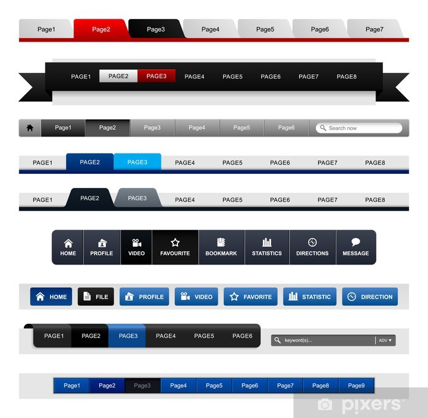

# 🔥 Welcome to Week 2! 🔥

## Topics and Components

This week, we will be covering these components

### 🧭 Navigation Bar

- Must contain the home, about, projects, involvements, and resume pages as options
- Must clearly be able to separate the ‘active’ page from the rest
- Must have a collapsible menu when the screen is reduced
- Want to add a logo on your nav bar? It must be a png or other photo like file (could be your name)

### 🏠 Home Page (index.html)

- Displays your name, school, and graduation year
- Page is filled with an image that completely fills the screen
- Navigation bar blends in with the page

### 🦶🏽 Footer

- Have icons linking to your social medias.
- Optional contact information

Source: [Fabi's Website](https://fabi-barbarino.github.io/FabiannaBarbarino/index.html)

By the end of this section, you should have your home page and navigation bar setup! Friendly reminder that you do not have to follow this guide to a T.

⏩ Continue >> to start the Navigation Bar section.