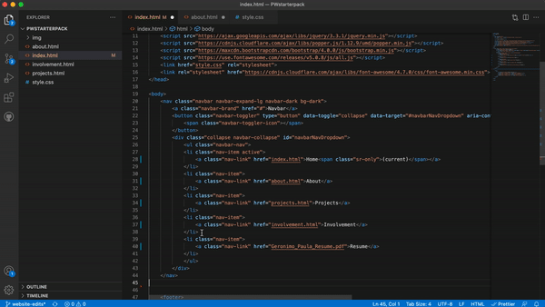
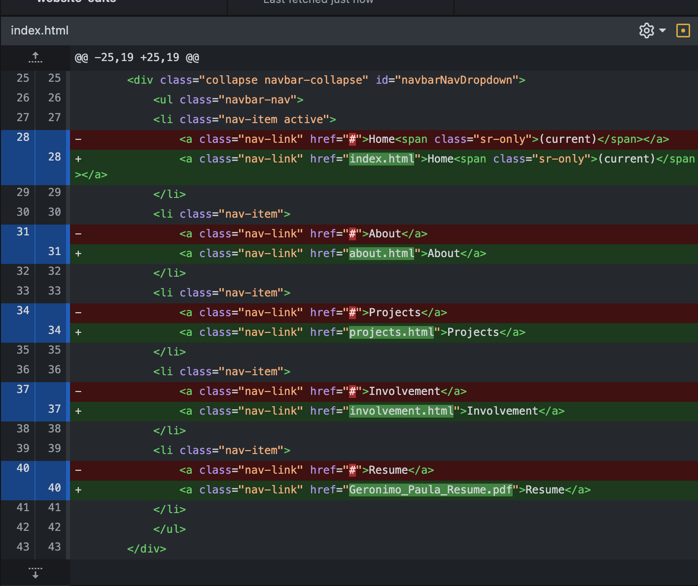

# 🔗 Linking Pages

So previously, you got to work on having six files, known as copies of your index/home file. Listed below are the files you should have.

    1. img folder - for images
    2. index.html - home page
    3. about.html - about page
    4. projects.html - projects page
    5. involvement.html - involvement page
    6. styles.css - styles file, more useful later

Now, lets get to the real deal...

## ➕ Adding links

1. Open your index.html file in VSCode, and locate the navbar section
2. Locate the navbar section within the body tag. Your navbar should look something like this

```
<nav class="navbar navbar-expand-lg navbar-dark bg-dark">
    <a class="navbar-brand" href="#">Navbar</a>
    <button class="navbar-toggler" type="button" data-toggle="collapse" data-target="#navbarNavDropdown" aria-controls="navbarNavDropdown" aria-expanded="false" aria-label="Toggle navigation">
        <span class="navbar-toggler-icon"></span>
    </button>
    <div class="collapse navbar-collapse" id="navbarNavDropdown">
        <ul class="navbar-nav">
        <li class="nav-item active">
            <a class="nav-link" href="#">Home<span class="sr-only">(current)</span></a>
        </li>
        <li class="nav-item">
            <a class="nav-link" href="#">About</a>
        </li>
        <li class="nav-item">
            <a class="nav-link" href="#">Projects</a>
        </li>
        <li class="nav-item">
            <a class="nav-link" href="#">Involvement</a>
        </li>
        <li class="nav-item">
            <a class="nav-link" href="#">Resume</a>
        </li>
        </ul>
    </div>
</nav>
```

3. See where it says ```<a class="nav-link" href="#">Projects</a>```? Replace the ```#``` with the respective file name, in this case, projects.html
4. Repeat for all navbar links, **except** the resume page for now.
    - You don't have to do this now, but if you want to get ahead...
        1. Drag & drop your resume file into the same file as your repo
        2. Once you have your resume file name, replace the ```#``` with it.
    - Such as if my file name is ```Geronimo_Paula_Resume.pdf```, the one like will look like ```<a class="nav-link" href="Geronimo_Paula_Resume.pdf">Resume</a>```

## 🗂 Proper file organizaiton

Minor changes to all files **but** the index.html file will include:

- Removing the ```<div></div>``` consisting of the home page's background & text
- Replacing the old navbar to the updated navbar

If you know how to do that, go ahead. For more detailed steps, follow them bellow.

1. Remove the div consisting of what we added to the home page. It should look something like this:

```
<div class="text-center align-self-center">
    <p class="name text-center h1">Paula L. Geronimo</p>
    <p class="text-center h1 backtext">Texas A&M'23</p>
    <p class="text-center h2 backtext">Technology Management</p>
</div>
```

with your information instead, of course. Remove it from all the other files. For file management, instead of openeing one by one on a different VSCode window, you have tabs to toggle from.
2. Once you have removed that from every file, go ahead and select, copy *everything* in the ```<navbar></navbar>``` tag, *then* select the old navbar in your other file, and paste.


3. Select & paste for every file.

## ⏩ Commit & Push

Your github edits should just consist of changed you made this week. Open up Github Desktop to view. It should look like this



1. Write your summary "Week 3 changes and updates" with an optional detailed description
2. Commit to **main**
3. Push your changes, and now, head on over to your website *username*.github.io to view live updated changes.

### 🎉 Congratulations! You have completed this section 🥳

## 🎈 Thank you for joining us this week! We look forward to you continuing.🤓
💡*[Feedback HERE](https://forms.gle/YMrVupARi3CPyzQYA)*🤔