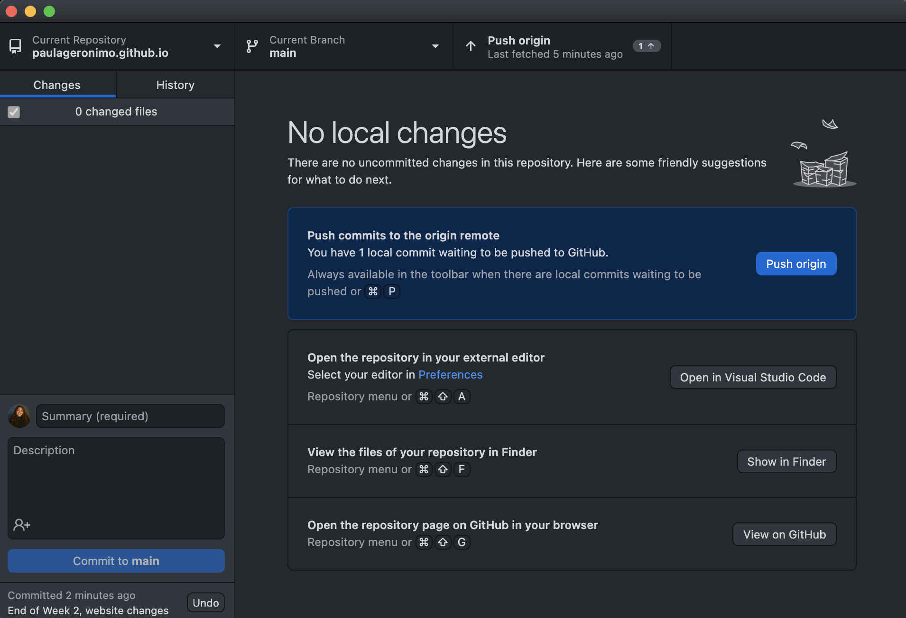

# ⏩ Commits & Push

Below will be a brief explanation differentiating both the Git push vs Git commit, and how it is expected to be used. After that, we will be committing AND pushing our changes to in our website repo.


## 🤨 Why do I have to do this?

- Since we are working with Git version control using GitHub Desktop, you will be unable to view your updated changes as you proceed with your edits. Worst case scenario, what if you make a change, save, and everything suddenly stops working?
    - Git version control gives you the power to revert to old changes, recover files you have deleted, etc.

- Once you have successfully completed this, you will be able to view your website live as of what you've made so far.
- When you complete the entire guide, you will be able to share your link with recruiters and your friends, even adding it to your resume 😉
- It looks cool on your GitHub profile, something recruiters look at and judge you for. *Source: was told directly by a Goldman Sachs recruiter & have read it internet forums (Reddit & Blind)*

## 🤔 What is a Commit?

I hope none of y'all have commitment issues... we will be doing a lot of committing here. 😳 Especially those going into any programming field.

A ```commit``` *captures a snapshot of the project's currently staged changes. Committed snapshots can be thought of as “safe” versions of a project—Git will never change them unless you explicitly ask it to.*

In other words, it is just a revision, whether adding or removing *anything* to your project repository. 

### A little extra for those considering going into industry...

You will be expected to be as short yet descriptive about your commits. Doing commits such as "Week 3" *push* is strongly looked down upon. Just for practice, try committing after every weekly subsection, just as "Removed navbar due to *xyz*", "Linked *xyz* pages onto the navbar", etc.

*Plus, you are able to see the amount of your commits on your GitHub. Recruiters look into our pages, so...*


## 🧐 What is a Push?

A push is only done if you want to push those changes onto the repo. A commit only keeps it locally, pushing PUSHES it to the actual Git location of your project.

*Pushing is how you transfer commits from your local repository to a remote repo.*


## 😩 How do I do it? I want to see my live website already!

Calmados! We get it, you might be *very* excited to see it live. First, you will do commits.

1. Go to GitHub Desktop application, make sure it is in your website repository.


*Side note*: You will definitely have more than just two changes. Above are mine just for example :)

2. In the summary section, type in "End of Week 2, website changes". Now click ```commit to main```.


3. Now, you will see your GitHub Desktop change. Select ```Push origin``` to push your changes to your website.



4. Finally, head over to your web browser, and type in *your username*.github.io in the search bar. You should now be able to see your website and be able to view it from other devices as well. **Try out your friends' links to view their website!**

## 🥳 You have now made a commit & pushed to your GitHub repository! 🤯